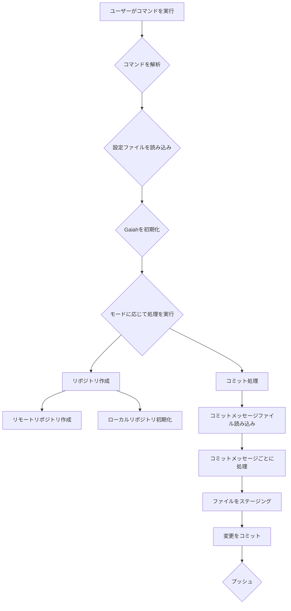

<p align="center">

<br>
<h1 align="center">Gaiah</h1>
<h2 align="center">
  ～Python Git Automation with Innovative Heuristics～

[](https://huggingface.co/spaces/MakiAi/Gaiah)
[](https://github.com/Gaiah/Sunwood-ai-labs "Go to GitHub repo")
[](https://github.com/Gaiah/Sunwood-ai-labs)
[](https://github.com/Gaiah/Sunwood-ai-labs)
[](https://github.com/Sunwood-ai-labs/Gaiah)
[](https://github.com/Sunwood-ai-labs/Gaiah)
[](https://github.com/Sunwood-ai-labs/Gaiah)
[](https://github.com/Sunwood-ai-labs/Gaiah)

</h2>

<p align="center">
  <a href="https://hamaruki.com/"><b>[🌐 Website]</b></a> •
  <!-- <a href="https://arxiv.org/abs/2309.17452"><b>[📜 Paper]</b></a> • -->
  <!-- <a href="https://huggingface.co/llm-agents"><b>[🤗 HF Models]</b></a> • -->
  <a href="https://github.com/Sunwood-ai-labs/Gaiah"><b>[🐱 GitHub]</b></a>
  <!-- <a href="https://9557c5365a6f44dc84.gradio.live"><b>[🐯 Gradio Demo]</b></a> -->
  <a href="https://twitter.com/hAru_mAki_ch"><b>[🐦 Twitter]</b></a> •
  <!-- <a href="https://www.reddit.com/r/LocalLLaMA/comments/1703k6d/tora_a_toolintegrated_reasoning_agent_for/"><b>[💬 Reddit]</b></a> • -->
  <a href="https://hamaruki.com/how-to-control-git-with-python-example-of-using-the-gaiah-library/">[🍀 Official Blog]</a>
  <!-- <a href="#-quick-start">Quick Start</a> • -->
  <!-- <a href="#%EF%B8%8F-citation">Citation</a> -->
</p>

</p>

>[!IMPORTANT]
>このリポジトリは[SourceSage](https://github.com/Sunwood-ai-labs/SourceSage)を活用しており、リリースノートやREADME、コミットメッセージの9割は[SourceSage](https://github.com/Sunwood-ai-labs/SourceSage) ＋ [claude.ai](https://claude.ai/)で生成しています。

## 🌟 はじめに

Gaiah は、Python で書かれた、Git リポジトリ管理を支援するツールです。v0.6.0 では、Markdown 形式のコミットメッセージファイル `.Gaiah.md` を使って、複数のコミットを一度に処理できるようになりました。

## 🚀 Gaiahの特徴

- **Markdown でコミットメッセージ作成**: `.Gaiah.md` ファイルに Markdown 形式でコミットメッセージを記述し、`gaiah --process_commits` コマンドで複数のコミットを一度に実行できます。
- **設定ファイルの導入**: `.gaiah/config.yml` ファイルで、リポジトリ名、説明、公開/非公開などの設定をカスタマイズできます。
- **テンプレート設定ファイル**: 初めて Gaiah を使う際に、`.gaiah/config.yml` ファイルのテンプレートが自動生成されます。
- **モード選択**: `--mode` オプションで、`commit`（コミット処理）または `make`（リポジトリ作成）のモードを選択できます。
- **AI 開発に最適化**: Gaiahは、AIを活用した開発ワークフローにシームレスに統合できるように設計されています。
- **直感的なコマンドラインインターフェース**: シンプルで覚えやすいコマンドで、Git操作を効率的に実行できます。
- **拡張性の高いアーキテクチャ**: Gaiahは、将来の機能拡張やカスタマイズに対応できる柔軟な設計を採用しています。

## 📦 インストール方法

```bash
pip install gaiah-toolkit
```

## 🎉 使い方

### リポジトリの作成と初期コミット

1.  プロジェクトのルートディレクトリに移動します。
2.  以下のコマンドを実行して、リポジトリを作成し、初期コミットを行います。

```bash
gaiah --mode make
```

### コミットの実行

1.  `.Gaiah.md` ファイルに、Markdown 形式でコミットメッセージを記述します。
2.  以下のコマンドを実行して、コミットを実行します。

```bash
gaiah --mode commit
```

### 設定のカスタマイズ

`.gaiah/config.yml` ファイルを編集して、リポジトリ名、説明、公開/非公開などの設定をカスタマイズできます。

## ⚙️ 設定ファイル `.gaiah/config.yml` の解説

```yaml
gaiah:  # 共通設定
  run: true
  repo:
    repo_name: "AIRA-Sample01"
    description: ""
    private: false
  local:
    repo_dir: "./"
    no_initial_commit: false
  commit:
    commit_msg_path: ".Gaiah.md"
    branch_name: null

  dev:  # 開発時の設定 (必要に応じて上書き)
    repo:
      create_repo: false
    local:
      init_repo: false
    commit:
      process_commits: true

  init:  # 初期化時の設定 (必要に応じて上書き)
    repo:
      create_repo: true
    local:
      init_repo: true
    commit:
      process_commits: false
```

- `gaiah`: 共通設定を定義します。
- `dev`: 開発時の設定を定義します。共通設定を上書きします。
- `init`: 初期化時の設定を定義します。共通設定を上書きします。
- 各セクションには、以下の設定項目があります。
    - `repo`: リポジトリに関する設定です。
        - `create_repo`: リモートリポジトリを作成するかどうかを指定します。
        - `repo_name`: リポジトリ名を指定します。
        - `description`: リポジトリの説明を指定します。
        - `private`: リポジトリを非公開にするかどうかを指定します。
    - `local`: ローカルリポジトリに関する設定です。
        - `init_repo`: ローカルリポジトリを初期化するかどうかを指定します。
        - `repo_dir`: ローカルリポジトリのディレクトリを指定します。
        - `no_initial_commit`: 初期コミットを作成しないかどうかを指定します。
    - `commit`: コミットに関する設定です。
        - `process_commits`: `.Gaiah.md` ファイルから複数のコミットを実行するかどうかを指定します。
        - `commit_msg_path`: `.Gaiah.md` ファイルのパスを指定します。
        - `branch_name`: コミットに使用するブランチ名を指定します。

## 🤖 Gaiahの処理フロー


    
## 🤝 開発に参加しよう


1. 新しいconda環境を作ります:
   ```
   conda create -n gaiah python=3.11
   ```
2. conda環境に入ります:
   ```
   conda activate gaiah
   ```
3. 必要なものをインストールします:
   ```
   pip install gitpython python-dotenv PyGithub termcolor art
   ```

便利なコマンド:
```bash
script\activate-gaiah.bat
```

```bash
gaiah --repo_dir C:\Prj\Gaiah_Sample\Gaiah_Sample05 --process_commits
gaiah --create_repo --repo_name AIRA --description "AIRA: AI-Integrated Repository for Accelerated Development" --init_repo --repo_dir C:\Prj\AIRA --process_commits --commit_msg_path .Gaiah.md
```

## 🤝 みんなでGaiahを良くしよう

Gaiahをもっと良くするアイデアや、バグを見つけたら、[GitHubのページ](https://github.com/Sunwood-ai-labs/Gaiah)で教えてください。

## 📄 ライセンス

GaiahはMITライセンスで公開されているので、自由に使ったり、変えたり、配ったりできます。

## 🙏 感謝

Gaiahは、次のようなすばらしいライブラリのおかげで作ることができました:

- [GitPython](https://github.com/gitpython-developers/GitPython)
- [python-dotenv](https://github.com/theskumar/python-dotenv)
- [PyGithub](https://github.com/PyGithub/PyGithub)
- [termcolor](https://pypi.org/project/termcolor/)
- [art](https://pypi.org/project/art/)

これらを作ってくれた人たちに感謝します。

---

さあ、Gaiahを使ってGitを楽しく使いこなしましょう! 🚀✨
