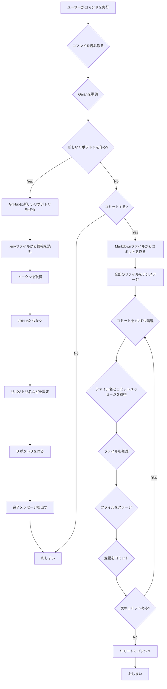

<p align="center">

<br>
<h1 align="center">Gaiah</h1>
<h2 align="center">
  ～Python Git Automation with Innovative Heuristics～

[](https://huggingface.co/spaces/MakiAi/Gaiah)
[](https://github.com/Gaiah/Sunwood-ai-labs "Go to GitHub repo")
[](https://github.com/Gaiah/Sunwood-ai-labs)
[](https://github.com/Gaiah/Sunwood-ai-labs)
[](https://github.com/Sunwood-ai-labs/Gaiah)
[](https://github.com/Sunwood-ai-labs/Gaiah)
[](https://github.com/Sunwood-ai-labs/Gaiah)
[](https://github.com/Sunwood-ai-labs/Gaiah)

</h2>

<p align="center">
  <a href="https://hamaruki.com/"><b>[🌐 Website]</b></a> •
  <!-- <a href="https://arxiv.org/abs/2309.17452"><b>[📜 Paper]</b></a> • -->
  <!-- <a href="https://huggingface.co/llm-agents"><b>[🤗 HF Models]</b></a> • -->
  <a href="https://github.com/Sunwood-ai-labs/Gaiah"><b>[🐱 GitHub]</b></a>
  <!-- <a href="https://9557c5365a6f44dc84.gradio.live"><b>[🐯 Gradio Demo]</b></a> -->
  <a href="https://twitter.com/hAru_mAki_ch"><b>[🐦 Twitter]</b></a> •
  <!-- <a href="https://www.reddit.com/r/LocalLLaMA/comments/1703k6d/tora_a_toolintegrated_reasoning_agent_for/"><b>[💬 Reddit]</b></a> • -->
  <a href="https://hamaruki.com/how-to-control-git-with-python-example-of-using-the-gaiah-library/">[🍀 Official Blog]</a>
  <!-- <a href="#-quick-start">Quick Start</a> • -->
  <!-- <a href="#%EF%B8%8F-citation">Citation</a> -->
</p>

</p>

>[!IMPORTANT]
>このリポジトリは[SourceSage](https://github.com/Sunwood-ai-labs/SourceSage)を活用しており、リリースノートやREADME、コミットメッセージの9割は[SourceSage](https://github.com/Sunwood-ai-labs/SourceSage) ＋ [claude.ai](https://claude.ai/)で生成しています。

## 🌟 はじめに

Gaiahは、初心者でも簡単に使えるPythonのライブラリです。Gitを使ってファイルの管理をするのを助けてくれます。新しいバージョンのGaiahでは、Markdownでコミットメッセージをかけるようになりました。

## 🚀 Gaiahの特徴

- 🤖 **AIにやさしい**: AIを使った開発に合わせて作られています。
- 🌐 **リモートリポジトリ**: GitHubなどのサービスとつながります。
- 📂 **リポジトリ管理**: 新しいリポジトリを作ったり、ファイルを追加したり、コミットしたり、ブランチを管理したりできます。
- 🔧 **カスタマイズ**: 自分の好みに合わせてGitの使い方を変えられます。
- 📘 **Markdownでコミット**: Markdownで書いたファイルからコミットメッセージを作れます。

## 📦 インストールの仕方

Gaiahを使うには、次のコマンドを実行してください:

   ```
   pip install gaiah-toolkit
   ```

## 🎉 使い方

### コマンドライン

Gaiahはコマンドラインから使えます。例えば、こんなふうにコミットできます:
```bash
gaiah
```

もっと細かく指定することもできます:
```bash
gaiah --repo_dir="C:\\Prj\\Gaiah_Sample02" --commit_msg_path=./tmp2.md
```

### 新しいリポジトリを作る

```bash
gaiah --create_repo --repo_name Gaiah_Sample05 --description "Gaiah_Sample05 repo" --init_repo --repo_dir C:\Prj\Gaiah_Sample\Gaiah_Sample05 --process_commits --commit_msg_path .Gaiah.md
```

### .Gaiah.mdのコミットメッセージを一括送信

Gaiahでは、.Gaiah.mdファイルにMarkdown形式でコミットメッセージをまとめて書いておくことができます。そして、次のコマンドを実行すると、.Gaiah.mdに書かれたコミットメッセージが一括でリポジトリに送信されます:

```bash
gaiah --process_commits
```

このコマンドを使えば、たくさんのコミットメッセージを一度に処理できるので、とても便利です。

## Gaiahの中身

Gaiahの処理の流れは、次の図のようになっています:



## 開発者向け

1. 新しいconda環境を作ります:
   ```
   conda create -n gaiah python=3.11
   ```
2. conda環境に入ります:
   ```
   conda activate gaiah
   ```
3. 必要なものをインストールします:
   ```
   pip install gitpython python-dotenv PyGithub termcolor art
   ```

便利なコマンド:
```bash
script\activate-gaiah.bat
```

```bash
gaiah --repo_dir C:\Prj\Gaiah_Sample\Gaiah_Sample05 --process_commits
gaiah --create_repo --repo_name AIRA --description "AIRA: AI-Integrated Repository for Accelerated Development" --init_repo --repo_dir C:\Prj\AIRA --process_commits --commit_msg_path .Gaiah.md
```

## 🤝 みんなでGaiahを良くしよう

Gaiahをもっと良くするアイデアや、バグを見つけたら、[GitHubのページ](https://github.com/Sunwood-ai-labs/Gaiah)で教えてください。

## 📄 ライセンス

GaiahはMITライセンスで公開されているので、自由に使ったり、変えたり、配ったりできます。

## 🙏 感謝

Gaiahは、次のようなすばらしいライブラリのおかげで作ることができました:

- [GitPython](https://github.com/gitpython-developers/GitPython)
- [python-dotenv](https://github.com/theskumar/python-dotenv)
- [PyGithub](https://github.com/PyGithub/PyGithub)
- [termcolor](https://pypi.org/project/termcolor/)
- [art](https://pypi.org/project/art/)

これらを作ってくれた人たちに感謝します。

---

さあ、Gaiahを使ってGitを楽しく使いこなしましょう! 🚀✨