<p align="center">

<br>
<h1 align="center">Gaiah</h1>
<h2 align="center">
  ～Python Git Automation with Innovative Heuristics～

[](https://huggingface.co/spaces/MakiAi/Gaiah)
[](https://github.com/Gaiah/Sunwood-ai-labs "Go to GitHub repo")
[](https://github.com/Gaiah/Sunwood-ai-labs)
[](https://github.com/Gaiah/Sunwood-ai-labs)
[](https://github.com/Sunwood-ai-labs/Gaiah)
[](https://github.com/Sunwood-ai-labs/Gaiah)
[](https://github.com/Sunwood-ai-labs/Gaiah)
[](https://github.com/Sunwood-ai-labs/Gaiah)

</h2>

<p align="center">
  <a href="https://hamaruki.com/"><b>[🌐 Website]</b></a> •
  <!-- <a href="https://arxiv.org/abs/2309.17452"><b>[📜 Paper]</b></a> • -->
  <!-- <a href="https://huggingface.co/llm-agents"><b>[🤗 HF Models]</b></a> • -->
  <a href="https://github.com/Sunwood-ai-labs/Gaiah"><b>[🐱 GitHub]</b></a>
  <!-- <a href="https://9557c5365a6f44dc84.gradio.live"><b>[🐯 Gradio Demo]</b></a> -->
  <a href="https://twitter.com/hAru_mAki_ch"><b>[🐦 Twitter]</b></a> •
  <!-- <a href="https://www.reddit.com/r/LocalLLaMA/comments/1703k6d/tora_a_toolintegrated_reasoning_agent_for/"><b>[💬 Reddit]</b></a> • -->
  <a href="https://hamaruki.com/how-to-control-git-with-python-example-of-using-the-gaiah-library/">[🍀 Official Blog]</a>
  <!-- <a href="#-quick-start">Quick Start</a> • -->
  <!-- <a href="#%EF%B8%8F-citation">Citation</a> -->
</p>

</p>

>[!IMPORTANT]
>このリポジトリは[SourceSage](https://github.com/Sunwood-ai-labs/SourceSage)を活用しており、リリースノートやREADME、コミットメッセージの9割は[SourceSage](https://github.com/Sunwood-ai-labs/SourceSage) ＋ [claude.ai](https://claude.ai/)で生成しています。

## 🌟 はじめに

Gaiahは、直感的でAIにやさしいメソッドを使用してGit操作を簡素化する革新的なPythonライブラリです。Gitリポジトリを制御するための高レベルなインターフェースを提供し、AIシステムがバージョン管理とシームレスに連携することを容易にします。新機能としてMarkdownから直接コミットを生成する機能が追加され、文書化されたコミットメッセージの管理がさらに効率的に行えます。

## 🚀 主な特徴

- 🤖 **AIフレンドリー**: AI主導の開発プロセスの独自の要件に対応するメソッドとユーティリティを提供し、AIを念頭に置いて設計されています。
- 🌐 **リモートリポジトリのサポート**: リモートリポジトリとのシームレスな連携を可能にし、GitHubやその他のGitホスティングプラットフォームにリポジトリを作成、クローン、プッシュできるようにします。 
- 📂 **リポジトリ管理**: 新しいリポジトリの初期化、ファイルの追加、コミットの作成、ブランチの管理をシンプルなPythonコードを介して簡単に行うことができます。
- 🔧 **カスタマイズ**: 柔軟性とカスタマイズオプションを提供し、特定のニーズと設定に合わせてGitワークフローを調整できます。
- 📘 **Markdownからのコミット生成**: Markdown形式のドキュメントから直接コミットを生成する機能を追加し、文書化されたコミットメッセージの効率的な管理を可能にします。

## 📦 インストール

Gaiahの使用を開始するには、次の手順に従ってください:

1. 新しいconda環境を作成します:
   ```
   conda create -n gaiah python=3.11
   ```
2. conda環境をアクティベートします:
   ```
   conda activate gaiah
   ```
3. 必要な依存関係をインストールします:
   ```
   pip install gitpython python-dotenv PyGithub termcolor art
   ```

## 🎉 使用方法

### CLI

GaiahのCLI機能により、コマンドラインから直接Git操作を行うことができます。例えば、以下のコマンドを使用してリポジトリにコミットを追加することができます:
```bash
gaiah
```

### 応用的な使い方

特定のプロジェクトディレクトリでGaiahを使用する場合、以下のようにリポジトリの場所やコミットメッセージのファイルパスを指定できます:

```bash
gaiah --repo_dir="C:\\Prj\\Gaiah_Sample02" --commit_msg_path=./tmp2.md
```

### リポジトリの初期化

```bash
gaiah --create_repo --repo_name Gaiah_Sample05 --description "Gaiah_Sample05 repo" --init_repo --repo_dir C:\Prj\Gaiah_Sample\Gaiah_Sample05 --process_commits --commit_msg_path .Gaiah.md
```

## 処理フロー

```mermaid

graph TD
   A[ユーザーがCLIを実行] --> B{コマンドライン引数を解析}
   B --> C{Gaiahオブジェクトを作成}
   C --> D{--create_repoオプションが指定されている?}
   D -->|Yes| E[新しいリポジトリをGitHub上に作成]
   E --> E1[.envファイルから環境変数を読み込む]
   E1 --> E2[環境変数からアクセストークンを取得]
   E2 --> E3[GitHubオブジェクトを作成]
   E3 --> E4[リポジトリ名とパラメータを指定]
   E4 --> E5[GitHub上に新しいリポジトリを作成]
   E5 --> E6[リポジトリ作成完了のメッセージを表示]
   E6 --> Q[処理完了]
   D -->|No| F{--process_commitsオプションが指定されている?}
   F -->|Yes| G[コミットメッセージファイルからコミットを処理]
   G --> H[すべてのファイルをアンステージ]
   H --> I{コミットセクションごとに処理}
   I --> J{ファイル名とコミットメッセージを取得}
   J --> K{ファイルを処理}
   K --> L{ファイルをステージ}
   L --> M{変更をコミット}
   M --> N{次のコミットセクションがある?}
   N -->|Yes| I
   N -->|No| O[リモートリポジトリにプッシュ]
   O --> P[処理完了]
   F -->|No| Q[処理完了]

```



## 開発用

```bash
gaiah --repo_dir C:\Prj\Gaiah_Sample\Gaiah_Sample05 --process_commits
```


## 🤝 貢献

Gaiahをさらに良くするために、コミュニティからの貢献を歓迎します。アイデア、提案、バグ報告がある場合は、[GitHubリポジトリ](https://github.com/Sunwood-ai-labs/Gaiah)で issue を開くか、プルリクエストを送信してください。

## 📄 ライセンス

Gaiahは、[MITライセンス](https://opensource.org/licenses/MIT)の下でリリースされており、ライブラリの自由かつオープンソースでの使用、変更、配布が可能です。

## 🙏 謝辞

Gaiahは、以下のライブラリの優れた機能に基づいて構築されています:

- [GitPython](https://github.com/gitpython-developers/GitPython)
- [python-dotenv](https://github.com/theskumar/python-dotenv)
- [PyGithub](https://github.com/PyGithub/PyGithub)
- [termcolor](https://pypi.org/project/termcolor/)
- [art](https://pypi.org/project/art/)

これらのプロジェクトの開発者とコントリビューターの皆様が、オープンソースコミュニティに貴重な貢献をしてくださったことに感謝します。

---

Gaiahを使用してGitワークフローの自動化を開始し、AI主導の開発の力を解き放ちましょう! 🚀✨